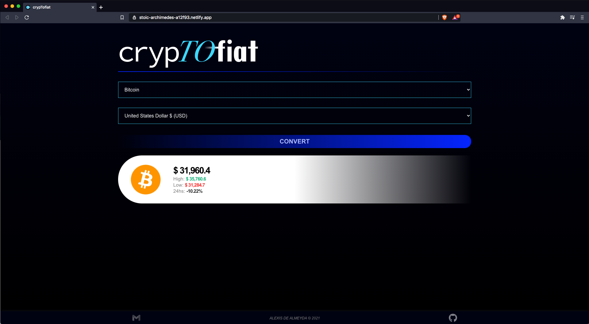

# <div align="center"> crypTofiat 📋</div>
## <a href="https://stoic-archimedes-a12f93.netlify.app/" target="_blank">LIVE DEMO</a>
<a href="">

</a>
<a href="">

</a>

<p align="center">Cryptocurrencies to fiat-currencies converter</p>

<p align="center">I made everything from the code to the graphics, logos and illustrations. 
I used React.JS, Adobe Illustrator and Adobe Photoshop.</p>

## 🛠️ Technologies

<ul>
  <li><a href="https://reactjs.org/">React.JS</a></li>
  <li><a href="https://www.adobe.com/la/products/illustrator.html">Adobe Illustrator</a></li>
</ul>

## ⚙️ Requirements

<ul>
  <li><a href="https://git-scm.com/">Git</a></li>
  <li><a href="https://nodejs.org/en/">Node.js</a></li>
  <li><a href="https://www.npmjs.com/">NPM</a></li>
</ul>

## 🚀 Installation

```
$ git clone https://github.com/AlexisTercero/DogCatAppointmentApp.git
$ npm install
$ npm start
```

The application will open in your browser on http://localhost:3000